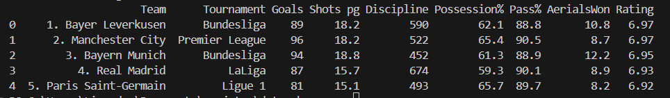

# Getting Data from WhoScored: Projeto de Web Scraping com Selenium

Este repositório contém um projeto de Web Scraping para acessar e extrair dados de websites que possuem mecanismos de proteção mais avançados. Utilizamos o Selenium para simular a interação humana com páginas web, permitindo contornar algumas restrições impostas a scripts tradicionais de web scraping.

## Estrutura do Repositório

- **data/**: Contém os dados obtidos através do web scraping, persistidos em arquivos.
- **images/**: Contém as imagens utilizadas no tutorial.
- **requirements.txt**: Arquivo com as bibliotecas necessárias para executar o projeto.
- **scrapper.py**: Arquivo principal com o código do projeto de web scraping.
- **tutorial.md**: Tutorial detalhado explicando o passo a passo da implementação.

## Instalação

Antes de executar o projeto, você precisa instalar o Python e as bibliotecas necessárias. Siga as instruções abaixo:

1. **Clone o repositório:**

    ```bash
    git clone https://github.com/seu-usuario/seu-repositorio.git
    cd seu-repositorio
    ```

2. **Crie um ambiente virtual (opcional, mas recomendado):**

    ```bash
    python -m venv venv
    source venv/bin/activate  # No Windows, use `venv\Scripts\activate`
    ```

3. **Instale as bibliotecas listadas no arquivo `requirements.txt`:**

    ```bash
    pip install -r requirements.txt
    ```

4. **Faça o download do ChromeDriver:**

    - Acesse o [site de downloads do Google Chrome](https://googlechromelabs.github.io/chrome-for-testing/).
    - Baixe a versão do `chromedriver` compatível com seu sistema operacional.
    - Extraia o arquivo e anote o caminho do executável `chromedriver`.

## Execução

1. **Edite o arquivo `scrapper.py` para especificar o caminho do `chromedriver`:**

    Abra o arquivo `scrapper.py` e modifique a linha onde o `chrome_driver` é definido, substituindo `"endereco/do/arquivo/chromedriver.exe"` pelo caminho do seu `chromedriver`.

2. **Execute o script `scrapper.py`:**

    ```bash
    python scrapper.py
    ```

## Estrutura do Código

O arquivo `scrapper.py` contém as seguintes seções principais:

1. **Importação das Bibliotecas:**
    - Importação do Beautiful Soup, Selenium e Pandas.

2. **Configuração do WebDriver:**
    - Configuração do Selenium WebDriver com o ChromeDriver.

3. **Acesso ao Website:**
    - Utilização do Selenium para acessar a página desejada e obter o código-fonte.

4. **Extração e Tratamento dos Dados:**
    - Uso do Beautiful Soup para processar o HTML e extrair os dados da tabela.
    - Armazenamento dos dados extraídos em um DataFrame do Pandas.

5. **Persistência dos Dados:**
    - Salvamento dos dados extraídos no diretório `data/`.

## Tutorial

Para um guia passo a passo detalhado, consulte o arquivo `tutorial.md` incluído no repositório.

## Contribuição

Sinta-se à vontade para contribuir com este projeto. Você pode abrir uma issue ou enviar um pull request. Toda contribuição é bem-vinda!

---

Espero que este projeto e tutorial sejam úteis para você. Se tiver alguma dúvida ou sugestão, entre em contato!



*Resultado do Nosso Código*

---

**Autor:** Lisandra Melo  
**Contato:** [lisandramelo34@gmail.com](mailto:lisandramelo34@gmail.com)
&copy; 2024.