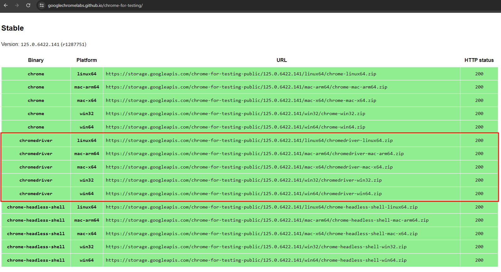
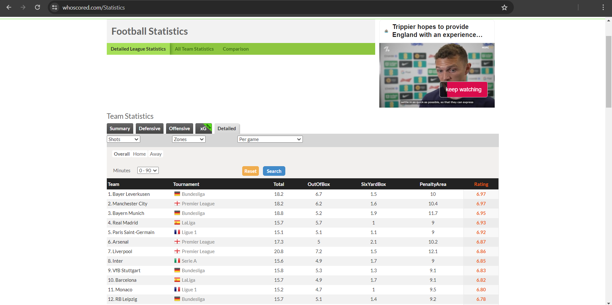

# Getting Data from WhoScored: Projeto de Web Scraping com Selenium

Há algum tempo, escrevi um [post no dev.to sobre Web Scraping com Python, Beautiful Soup e Requests](https://dev.to/lisandramelo/extracting-data-from-transfermarkt-an-introduction-to-webscraping-2i1c). Embora esse post ofereça uma base sobre o processo de raspagem de dados na maioria dos websites, em alguns casos, essa abordagem não é suficiente. Alguns sites são configurados para evitar o acesso automatizado para raspagem de dados. Em geral, os websites buscam evitar robôs que podem causar sobrecargas nos servidores e usuários que podem obter informações e usá-las sem o devido crédito.

Apesar dessas proteções, o uso de ferramentas de automações em sites podem ser essencial para a criação de soluções de automação, testes e análise de dados de aplicações web. Por isso, aprender sobre essas ferramentas é fundamental para o desenvolvimento, teste e análise de websites com proteções anti-crawlers.

Neste tutorial, vamos explorar como utilizar o Selenium para acessar e extrair dados de websites que possuem mecanismos de proteção mais avançados. O Selenium é ferramenta para  automação de navegadores que pode simular a interação humana com páginas web, permitindo contornar algumas restrições impostas a scripts tradicionais de web scraping.

## Requisitos e Instalação de Bibliotecas

Antes de começar a produzir o código em si, teremos de garantir que temos todas as ferramentas necessárias. Dessa forma, garanta que você possua os seguintes requisitos:

- [Python instalado em sua máquina](https://www.python.org/downloads/);
- Biblioteca Selenium para Python;
- Biblioteca BeautifulSoup para Python;
- Biblioteca Pandas para Python;
- WebDriver de navegador.

### Instalação de Ferramentas Necessárias

#### Instalação Selenium
A biblioteca Selenium para Python é uma ferramenta para automatizar interações com navegadores web. O Selenium permite que você escreva scripts em Python que exijam ações em um navegador, como clicar em botões, preencher formulários, navegar entre páginas e extrair dados de sites com proteções anti-crawlers.

Para instalar a biblioteca do [Selenium](https://pypi.org/project/selenium/) você pode usar o [pip](https://pypi.org/project/pip/).

```bash
pip install selenium
```

#### Instalação BeautifulSoup

A biblioteca BeautifulSoup é uma ferramenta para extrair dados de arquivos HTML e XML. Ela torna a navegação, a busca e a modificação de documentos HTML e XML simples e eficaz.

Para instalar a biblioteca do [Beautiful Soup](https://pypi.org/project/beautifulsoup4/) você também pode usar o [pip](https://pypi.org/project/pip/).

```bash
pip install beautifulsoup4
```

#### Instalação Pandas

A biblioteca Pandas oferece estruturas de dados de alto desempenho e funções para manipulação de dados, tornando os processos de análise e ciência de dados mais eficientes e intuitivos.

Para instalar a biblioteca do [Pandas](https://pypi.org/project/pandas/) você também pode usar o [pip](https://pypi.org/project/pip/).

```bash
pip install pandas
```

#### Download WebDriver

A ferramenta do Selenium usa Web Drivers para realizar atividades de automações. Um WebDriver é uma ferramenta usada para automatizar testes em navegadores web. Ele permite que desenvolvedores e testadores controlem um navegador (como Chrome, Firefox ou Safari) programaticamente, simulando a interação de um usuário real. Um dos WebDrivers mais populares é o Selenium WebDriver, que oferece suporte a diversos navegadores e linguagens de programação, como Python, Java e C#.

O [ChromeDriver](https://developer.chrome.com/docs/chromedriver?hl=pt-br) é um componente específico do Selenium WebDriver que permite controlar o navegador Google Chrome. Ele serve como uma ponte entre o Selenium WebDriver e o navegador, possibilitando que os testes automatizados sejam executados no Chrome.

Para fazer o download da ferramenta, é necessário acessar o [site de downloads do Google Chrome](https://googlechromelabs.github.io/chrome-for-testing/) e selecionar a versão de chromedriver compatível com seu Sistema Operacional.


*Versões Estáveis do Chrome Driver Disponíveis*

Após fazer o download do arquivo compactado correspondente, extraia os arquivos e guarde o local do arquivo chromedriver.exe, pois ele será usado posteriormente.

## Implementação

O primeiro passo da implementação do nosso projeto será a importação das bibliotecas que usaremos. Para isso, use o trecho de código a seguir. O trecho importa a Beautiful Soup, a biblioteca Selenium e a biblioteca Pandas.

```python
from bs4 import BeautifulSoup
from selenium.webdriver.chrome.service import Service
from selenium import webdriver
import pandas as pd
```

Com as bibliotecas importadas, podemos configurar nosso web driver para acessar páginas da internet. Para a configuração, o construtor do [Selenium WebDriver](https://www.selenium.dev/documentation/webdriver/browsers/chrome/) precisa de um [serviço - Service](https://www.selenium.dev/documentation/webdriver/drivers/service/), que é usado para configurar e gerenciar o serviço do WebDriver para o Chrome, como especificar o caminho para o executável do ChromeDriver e definir argumentos adicionais; e opções para a instância do navegador Chrome. Dessa forma, no trecho abaixo estamos configurando e instanciando nosso objeto responsável pela obtenção e manipulação da página.

```python
chrome_options = webdriver.chrome.options.Options()
chrome_driver = "endereco/do/arquivo/chromedriver.exe"
service_to_pass = Service(executable_path=chrome_driver)
wd = webdriver.Chrome(service=service_to_pass, options=chrome_options)
```

Agora, iremos realizar a ação necessária para obter dados da página que desejamos. Para isso, utilizaremos o método [get()](https://www.selenium.dev/documentation/webdriver/interactions/navigation/) do objeto criado. O método get é responsável por abrir o website. Posteriormente, utilizaremos a propriedade do objeto WebDriver chamada [page_source](https://selenium-python.readthedocs.io/api.html#selenium.webdriver.remote.webdriver.WebDriver.page_source), que nos dá acesso ao código-fonte (conteúdo) da página em questão.


Além disso, será necessário determinar o endereço da página que se deseja acessar. No projeto, usei o website [www.whoscored.com](https://www.whoscored.com/) especificamente sua página sobre [estatísticas](https://www.whoscored.com/Statistics). Este website possui proteção anti-crawler e, por isso, utilizando-a como teste, podemos notar a efetividade da ferramenta.


*Página Acessada no Tutorial*

```python
URL_BASE = "https://www.whoscored.com/Statistics"
wd.get(URL_BASE)
soup_file = wd.page_source
```

Após esse trecho, já podemos acessar todo o código HTML da página web. Podemos utilizar essa informação para testes, análises ou transformações necessárias. Ainda, podemos usar o WebDriver para preencher formulários, clicar em botões ou navegar entre páginas. Para o projeto atual, irei propor apenas a limpeza da informação não estruturada presente na página e sua transformação em dados estruturados.

Para isso, usaremos as bibliotecas Pandas e Beautiful Soup importadas anteriormente. Caso você tenha dificuldades em acompanhar o código a seguir, indico buscar meu tutorial de[Introdução ao WebScraping](https://dev.to/lisandramelo/recebendo-informacoes-do-transfermarkt-uma-introducao-ao-web-scraping-188o), já que ele introduz cada uma das funções usadas a seguir.

A primeira parte do tratamento consiste em passar o código-fonte pelo analisador de HTML da Beautiful Soup.

```python
soup_page = BeautifulSoup(soup_file, "html.parser")
```

Agora, iremos buscar os dados que desejamos. No projeto, iremos obter dados da tabela destacada abaixo. São dados sumarizados com os 20 melhores clubes de acordo com as notas designadas pelo site.

[Tabela a ser Acessada](images/table.png)
*Tabela a ser Acessada*

Primeiro, acessaremos a tabela existente no HTML pelo seu ID.

```python
main_table = soup_page.find('div', {'id': 'top-team-stats-summary'})

team_sum_stats_table = main_table.find('table', {'id': 'top-team-stats-summary-grid'})
```
Agora, dentro da tabela, conseguiremos os nomes de colunas existentes.

```python
team_sum_stats_header = team_sum_stats_table.find_all('th')

header_columns = [column_name.text for column_name in team_sum_stats_header]
```

Note que o código acima usa [List Comprehension](https://www.w3schools.com/python/python_lists_comprehension.asp), esse tipo de recurso usa uma sintaxe mais limpa e simples para criar listas a partir de outras listas. Dessa forma, o código acima é equivalente ao proposto abaixo.

```python
team_sum_stats_header = team_sum_stats_table.find_all('th')

header_columns = []
    for column_name in team_sum_stats_header:
        header_columns.append(column_name.text)
```

Agora, vamos obter os dados de células da nossa tabela. Para isso, use o código abaixo.

```python
team_sum_stats_body = team_sum_stats_table.find('tbody').find_all('tr')

teams_stats = [[cell_value.text for cell_value in row.find_all('td')] for row in team_sum_stats_body]
```

Dessa vez, o código possui duas list comprehensions aninhadas. Talvez pareça complexo, mas na realidade o código proposto faz o mesmo que o código abaixo.

```python
teams_stats = []
for row in team_sum_stats_body:
    cells = row.find_all('td')
    row_values = []
    for cell_value in cells:
        row_values.append(cell_value.text)
    teams_stats.append(row_values)
```

Agora, já temos nossas colunas e nossas linhas de valores. Podemos então criar nosso DataFrame com informações estruturadas que estavam presentes no site. Para isso, use o código abaixo.

```python
df_sum = pd.DataFrame(teams_stats, columns=header_columns)

print(df_sum.head())
```

O código resultará nos cinco primeiros registros da tabela do site como a imagem abaixo.

[Resultado do Nosso Código](images/result.png)
*Resultado do Nosso Código*

## Repositório

O código completo do projeto está no meu [repositório do github](https://github.com/veronicamars73/Getting-WhoScored-Data).

## Considerações Finais

Espero que o tutorial ajude de alguma forma. Encorajo que implementem suas próprias versões e fico à disposição para ajudar como puder.

Deixo meu e-mail [lisandramelo34@gmail.com](mailto:lisandramelo34@gmail.com) e meu perfil no [LinkedIn](https://www.linkedin.com/in/melo-lisandra) caso desejem entrar em contato de alguma forma.