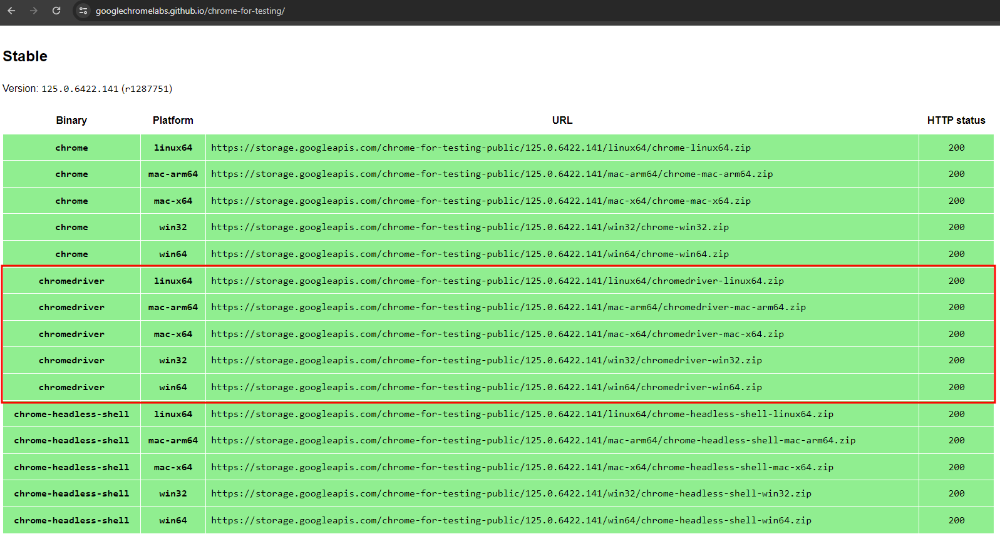

A while ago, I wrote a [post on dev.to about Web Scraping with Python, Beautiful Soup and Requests](https://dev.to/lisandramelo/extracting-data-from-transfermarkt-an-introduction-to-webscraping- 2i1c). While that post provided an overview of the data scraping process for most websites, in some cases this approach is not sufficient. Some websites are set to prevent automated access for data scraping. Usually, these websites aim to avoid robots that can cause server overloads or users who can obtain information and use it without due credit.

Despite these protections, the use of automation tools on websites can be essential for creating automations, testing, and data analysis solutions for web applications. Therefore, learning about these tools is essential for developing, testing, and analyzing websites with anti-crawler protections.

In this tutorial, we will explore how to use Selenium to access and extract data from websites that have more advanced protection mechanisms. Selenium is a browser automation tool that can simulate human interaction with web pages, allowing you to bypass some restrictions imposed on traditional web scraping scripts.

## Library Requirements and Installation

Before we start producing the code itself, we will need to ensure that we have all the necessary tools. Ensure that you meet the following requirements:

- [Python installed on your machine](https://www.python.org/downloads/);
- Selenium Library for Python;
- BeautifulSoup Library for Python;
- Pandas Library for Python;
- A Browser WebDriver.

### Installation of Required Tools

#### Selenium Installation
The Selenium library for Python is a tool for automating interactions with web browsers. Selenium allows you to write Python scripts that perform actions in a browser, such as clicking buttons, filling out forms, navigating between pages, and extracting data from websites with anti-crawler protections.

To install the [Selenium](https://pypi.org/project/selenium/) library, you can use [pip](https://pypi.org/project/pip/).

```bash
pip install selenium
```

#### BeautifulSoup Installation

The BeautifulSoup library is a tool for extracting data from HTML and XML files. It makes browsing, searching, and modifying HTML and XML documents simple and effective.

To install the [Beautiful Soup](https://pypi.org/project/beautifulsoup4/) library, you can also use [pip](https://pypi.org/project/pip/).

```bash
pip install beautifulsoup4
```

#### Pandas Installation

The Pandas library provides high-performance data structures and data manipulation functions, making data analysis processes more efficient and intuitive.

To install the [Pandas](https://pypi.org/project/pandas/) library, you can also use[pip](https://pypi.org/project/pip/).

```bash
pip install pandas
```

#### WebDriver Download

The Selenium tool uses WebDrivers to perform automation activities. A WebDriver is a tool used to automate testing in web browsers. It allows developers and testers to control a browser (such as Chrome, Firefox, or Safari) programmatically, simulating real user interaction. One of the most popular WebDrivers is Selenium WebDriver, which supports several browsers and programming languages, such as Python, Java, and C#.

[ChromeDriver](https://developer.chrome.com/docs/chromedriver?hl=pt-br) is a specific component of Selenium WebDriver that allows you to control a Google Chrome browser. It serves as a bridge between Selenium WebDriver and the browser, enabling automated tests to be run in Chrome.

To download it, go to the [Google Chrome download site](https://googlechromelabs.github.io/chrome-for-testing/) and select the version of `chromedriver` compatible with your Operating System.


*Chrome Driver Stable Versions Available*

After downloading the corresponding compressed file, extract the files and store the location of the `chromedriver.exe` file, as it will be used later on the project.

## Coding

Our first step in coding the project will be to import the libraries we will use. To do this, use the following code snippet. The snippet imports BeautifulSoup, the Selenium library, and the Pandas library.

```python
from bs4 import BeautifulSoup
from selenium.webdriver.chrome.service import Service
from selenium import webdriver
import pandas as pd
```

With the imported libraries, we can configure our web driver to access internet pages. For configuration, the [Selenium WebDriver](https://www.selenium.dev/documentation/webdriver/browsers/chrome/) constructor needs a [Service](https://www.selenium.dev/documentation/webdriver/drivers/service/), which is used to configure and manage the WebDriver service for Chrome, such as specifying the path to the ChromeDriver executable and defining additional arguments; and settings, or options, for the Chrome browser instance. Therefore, in the section below, we are setting and instantiating the object responsible for obtaining and manipulating the page.

```python
chrome_options = webdriver.chrome.options.Options()
chrome_driver = "endereco/do/arquivo/chromedriver.exe"
service_to_pass = Service(executable_path=chrome_driver)
wd = webdriver.Chrome(service=service_to_pass, options=chrome_options)
```

Now, we will execute the action to obtain data from the webpage we choose. To do this, we will use the [get()](https://www.selenium.dev/documentation/webdriver/interactions/navigation/) method from the created object. The get method is responsible for opening the website. Later, we will use the WebDriver object property called [page_source](https://selenium-python.readthedocs.io/api.html#selenium.webdriver.remote.webdriver.WebDriver.page_source), which returns the source code (content) of the webpage.


Moreover, you will need to chose the address of the page you want to access. In the project, I used the website [www.whoscored.com](https://www.whoscored.com/), specifically its page about [statistics](https://www.whoscored.com/Statistics). This website has anti-crawler protection and, thus, using it as a test, we can see the effectiveness of the tool.


*Webpage used in the Tutorial*

```python
URL_BASE = "https://www.whoscored.com/Statistics"
wd.get(URL_BASE)
soup_file = wd.page_source
```

After this section, we now have access to the entire HTML code of the webpage. We may use this information for testing, analysis or necessary transformations. Additionally, we can use a WebDriver to fill out forms, click on buttons, or navigate between pages. For the current project, I will only propose cleaning the unstructured information present on the page and transforming it into structured data.

For this, we will use the previously imported Pandas and BeautifulSoup libraries. If you have any trouble following the code below, I recommend reading my tutorial [Introduction to WebScraping](https://dev.to/lisandramelo/recebendo-informacoes-do-transfermarkt-uma-introducao-ao-web-scraping-188o), as it introduces each of the functions and methods used below.

The first part of the processing consists of passing the source code through BeautifulSoup's HTML parser.

```python
soup_page = BeautifulSoup(soup_file, "html.parser")
```

Now, we will fetch the data we want. In this project, we will obtain data from the table highlighted below. These are summarized data with the 20 best clubs according to the grades assigned by the website.

[Table Accessed](images/table.png)
*Table Accessed*

First, we will access the chosen table in HTML by its ID.

```python
main_table = soup_page.find('div', {'id': 'top-team-stats-summary'})

team_sum_stats_table = main_table.find('table', {'id': 'top-team-stats-summary-grid'})
```
Now, within the table, we will get the existing column names.

```python
team_sum_stats_header = team_sum_stats_table.find_all('th')

header_columns = [column_name.text for column_name in team_sum_stats_header]
```

Note that the code above uses [List Comprehension](https://www.w3schools.com/python/python_lists_comprehension.asp). This type of resource uses a cleaner and simpler syntax to create lists from other lists. Hence, the code above is equivalent to the one proposed below.

```python
team_sum_stats_header = team_sum_stats_table.find_all('th')

header_columns = []
    for column_name in team_sum_stats_header:
        header_columns.append(column_name.text)
```

Now, let's get the cell data from our table. To do it, use the code below..

```python
team_sum_stats_body = team_sum_stats_table.find('tbody').find_all('tr')

teams_stats = [[cell_value.text for cell_value in row.find_all('td')] for row in team_sum_stats_body]
```

This time, the code has two nested list comprehensions. Maybe it seems complex, but in reality, the proposed code does the same as the code below.

```python
teams_stats = []
for row in team_sum_stats_body:
    cells = row.find_all('td')
    row_values = []
    for cell_value in cells:
        row_values.append(cell_value.text)
    teams_stats.append(row_values)
```

Now, we already have our columns and rows of values. We can then create our DataFrame with structured information that was present on the website. To do this, use the code below.

```python
df_sum = pd.DataFrame(teams_stats, columns=header_columns)

print(df_sum.head())
```

The code will return the first five records in the website table like the image below.

[Program Output](images/result.png)
*Program Output*

## Repositório

The complete project code is in my [github repository](https://github.com/veronicamars73/Getting-WhoScored-Data).

## Considerações Finais

I hope the tutorial helps in some way. I encourage you to implement your own versions and I'm happy to help in any way I can.

I leave my email [lisandramelo34@gmail.com](mailto:lisandramelo34@gmail.com) and my profile on [LinkedIn](https://www.linkedin.com/in/melo-lisandra) if you want to get in touch.